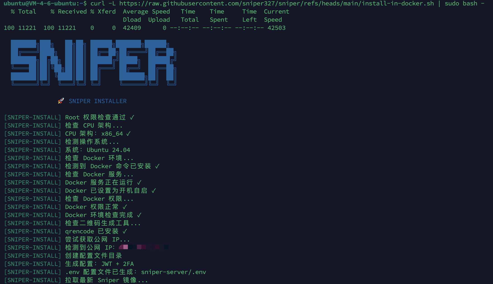
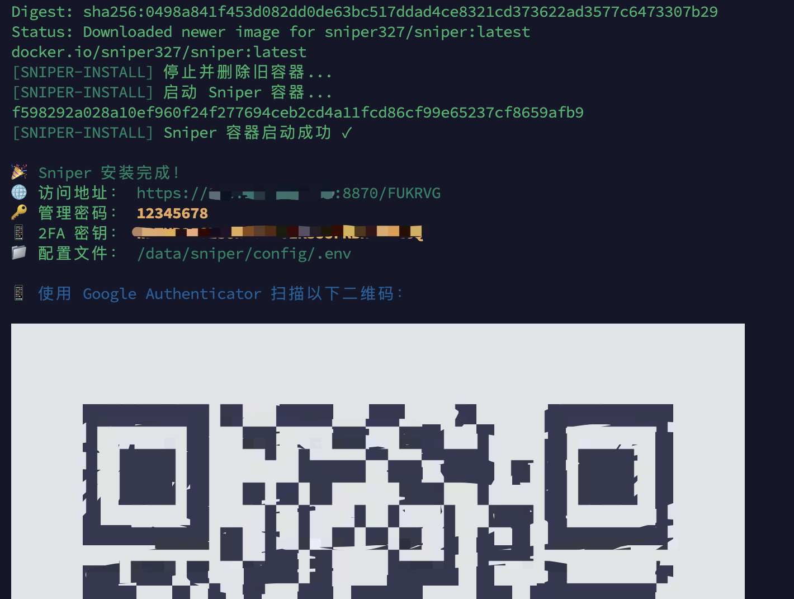
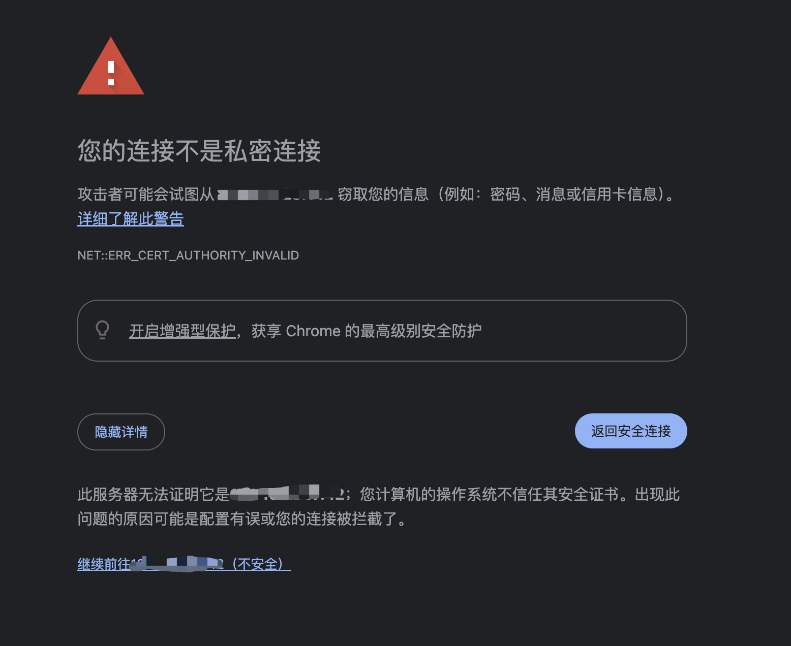
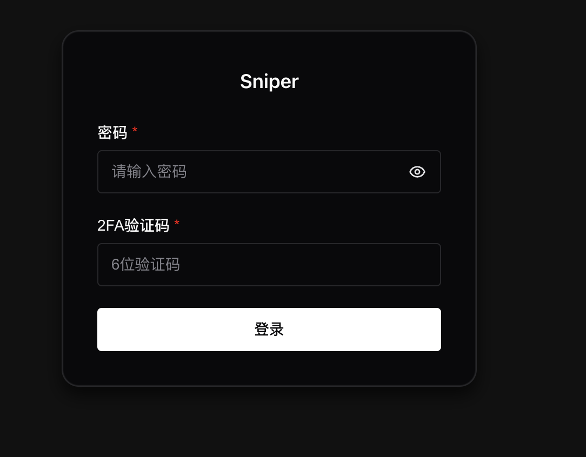
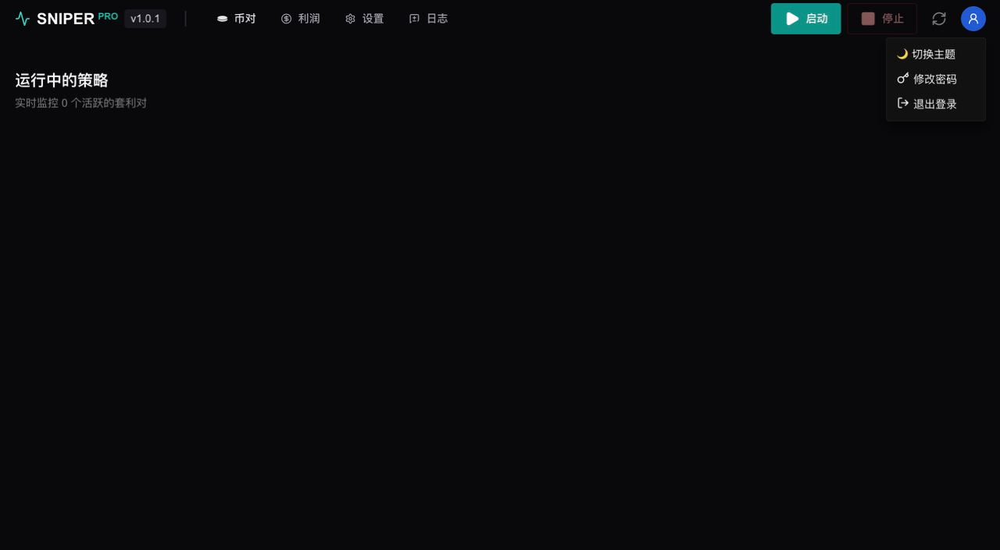
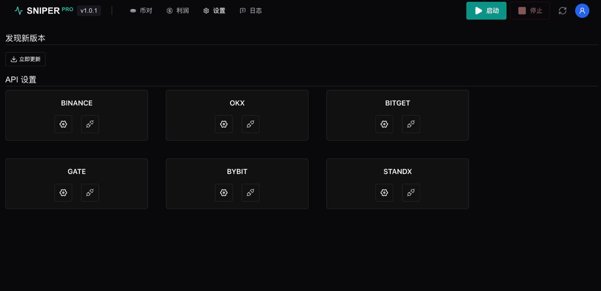
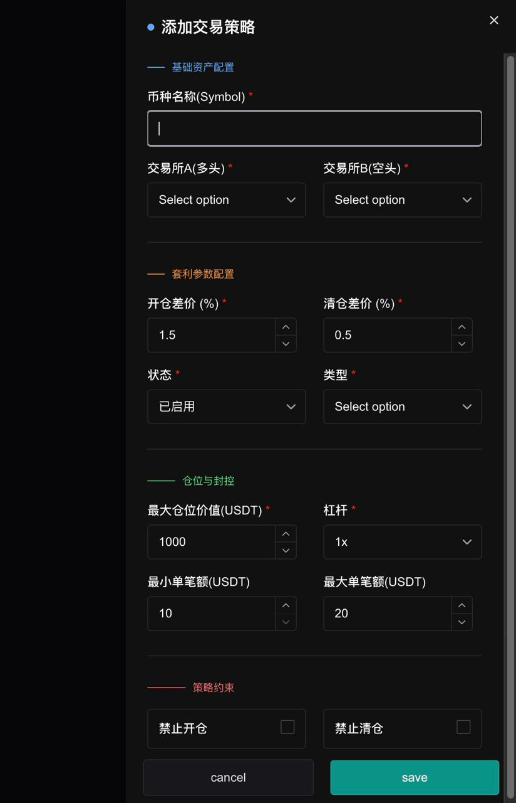
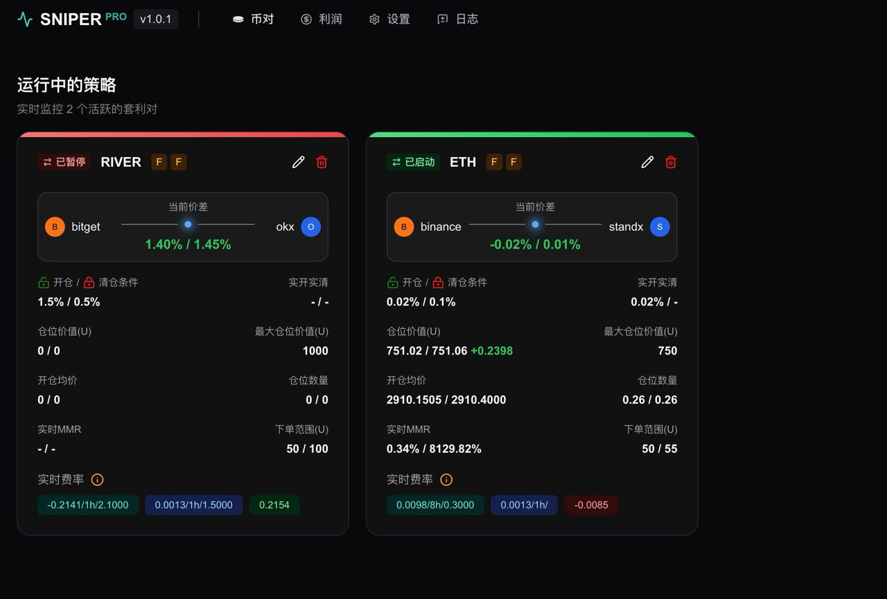

# Sniper 产品用户指南

## 1. 复制安装脚本到服务器页面

```bash
curl -L https://raw.githubusercontent.com/sniper327/sniper/refs/heads/main/install-in-docker.sh | sudo bash -
```

## 2. 安装脚本

配图：



检测到 IP 地址一般会自动获取，如果没有检测到，手动确定 IP 即可。

配图：



到这一步，Sniper 已成功安装并启动。

配图：



复制上面的访问地址到浏览器，就进入这个页面。首次访问可能会出现浏览器安全提示，这是由于使用自签名证书导致的。点击“高级”并选择“继续前往”即可正常进入系统，不影响使用。

配图：



输入初始管理密码，并填写 Google Authenticator 中的 6 位动态验证码，即可成功登录后台。

## 3. 首页工具区说明

配图：



### 左侧操作

- 币对：运行的策略币对信息
- 利润：查看已完成策略的收益统计
- 设置：系统与交易相关配置
- 日志：查看运行日志与错误信息

### 右侧操作

- 启动：启动所有的策略，获取实时价差
- 停止：停止全部正在运行的策略
- 刷新：手动刷新当前页面数据
- 用户：账户信息与相关操作，修改密码，退出，切换主题色

## 4. 设置页说明

配图：



### 4.1 程序更新

当检测到新版本时，点击“立即更新”，系统会自动完成更新，无需手动操作。

### 4.2 交易所配置

点击交易所卡片中的设置按钮，填写对应交易所的 API Key / Secret（及 Passphrase），保存配置。

### 4.3 测试 API 连接

点击测试按钮，用于检测 API 是否可用、权限是否正确。测试成功后，该交易所才能参与交易。

### 4.4 注意事项

API 建议仅开启交易权限，不要开启提现。

## 5. 添加新策略

配图：



点击首页“添加新策略”按钮，会出现策略配置弹窗。

### 5.1 基础资产配置

- 币种名称（Symbol）：填写交易对，如 BTC
- 交易所 A（多头）：选择做多的交易所
- 交易所 B（空头）：选择做空的交易所

### 5.2 套利参数配置

- 开仓差价（%）：达到该价差时自动开仓
- 清仓差价（%）：回落到该价差时自动平仓
- 状态：是否启用该策略
- 类型：选择策略类型（SF / FF）

### 5.3 仓位与风控

- 最大仓位价值（USDT）：单个策略允许使用的最大资金
- 杠杆：该策略使用的杠杆倍数
- 最小单笔额（USDT）：批量每次下单的最小金额
- 最大单笔额（USDT）：批量每次下单的最大金额

补充说明：

- Standx 交易所和其他交易所对冲 ETH 币时，最大仓位最小 50 USDT；开小了精度不够，容易单腿。

### 5.4 策略约束

- 禁止开仓：勾选后只监控，不新开仓
- 禁止清仓：勾选后不主动平仓

### 5.5 保存策略

- 点击 Save 保存并生效
- 点击 Cancel 放弃修改

## 6. 策略展示页

配图：



## 7. 实战演示视频

[https://x.com/CryptoSniperFi/status/2016512750223270157](https://x.com/CryptoSniperFi/status/2016512750223270157)
