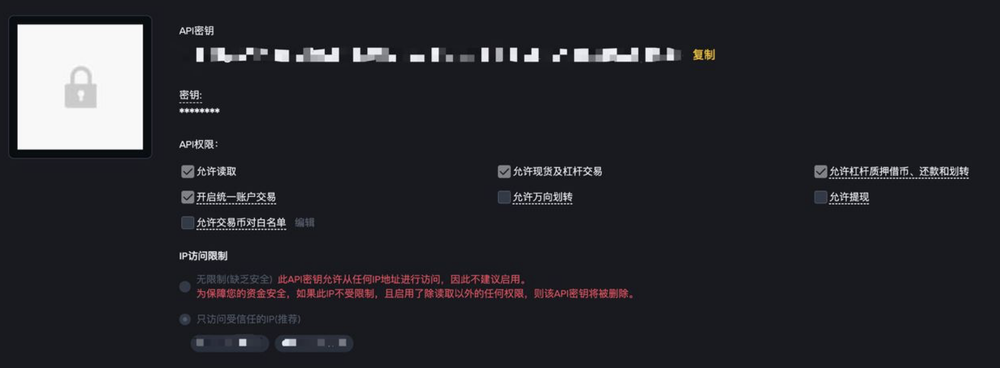
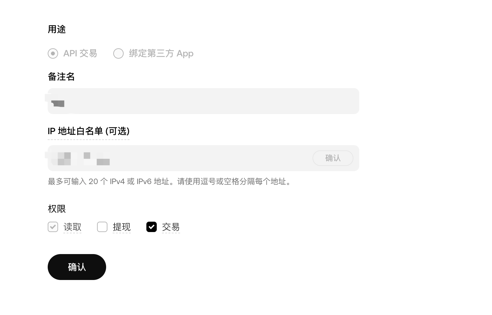

# Sniper 产品说明文档

## 🚀 Sniper 产品介绍

Sniper 是一款面向交易用户的 **跨交易所套利 & 多平台资金监控系统**，通过实时价格监控与半自动下单机制，Sniper 可以在两个交易所间捕捉价差机会，实现 低风险Spread套利 以及 资金费率搬砖收益，无需人工盯盘。
适合套利玩家搭建专属策略系统。

## 🚀 一键安装 Sniper（Docker 部署）

### ☁️ 云服务器环境要求

> **⚠️ 禁止使用中国大陆服务器**  
> 为保证连接交易所稳定、避免网络异常及风控触发，请部署在境外机器

推荐节点：
- 🇭🇰 香港
- 🇯🇵 日本、新加坡

推荐服务商：
- 阿里云 / 腾讯 / AWS / Vultr 等

> Sniper 不支持 **本地部署**，请注意：  
> 若交易所 API Key 开启 **IP 白名单绑定**，更换服务器或公网 IP 需重新配置！

---

### 🖥️ 系统与资源要求
> 当前版本 **仅支持 Ubuntu 系统部署**  

| 项目 | 最低要求 | 推荐配置 |
|---|---|---|
| 操作系统 | **Ubuntu (20.04/22.04+)** | Ubuntu 22.04 LTS |
| 架构 | **x86_64 |
| 内存 | **≥ 2GB** |  |


---

### 📌 开始部署

```bash
curl -L https://raw.githubusercontent.com/sniper327/sniper/refs/heads/main/install-in-docker.sh | sudo bash -
```
**🔥 安装完成后务必开放服务器端口 8870**
**‼️ 若未放行该端口，将无法访问 Web 面板！**

## ⚙ 配置文件 .env 说明
安装后会生成：📁 /data/sniper/config/.env

| 字段 | 作用说明 | 示例 |
|---|---|---|
| PORT | Web 运行端口 | 8870 |
| SERVER_IP | 服务器公网IP（用于外部访问） | 43.153.xxx.xxx |
| ADMIN_PASSWORD | 登录面板密码（建议登录后修改密码）| 12345678 |
| JWT_SECRET | 登录 Token 加密秘钥 | 随机字符如 Axd9... |
| TWO_FA_SECRET | Google 2FA 密钥 | 随机生成 | |
---

## 🔐 如何配置交易所 API？

> ⚠️ 安全至上，请严格遵守以下两条规则：

**‼️ 所有 API Key 必须绑定固定 IP 白名单 （强制）**  
**‼️ 请务必关闭 [提现/Withdraw] 权限（只需交易与读取权限）**

---

### a. Binance（币安）

使用前请确认：

1. **账户模式必须为「统一账户 Unified Account」**  
   若当前为标准账户，请先切换后再创建 API
2. 新建 API Key 后，开启以下权限：
   - ✔️ Read 权限
   - ✔️ Futures 交易权限
   - ❌ 禁止开启提现 Withdraw
3. **添加服务器 IP 到白名单**  
   未绑定会导致交易失败或被风控限制

**配置参考示例：**

> 添加 API → 选择「统一账户」 → 勾选交易权限 → 绑定白名单 IP → 保存



---

### b. Bitget

1. 创建 API Key，并为其绑定服务器公网 IP  
2. 权限配置建议：
   - ✔️ 读取数据
   - ✔️ 交易权限（需要开启双向持仓）
   - ❌ 禁止开启提现
3. 绑定服务器 IP，并妥善保存 Passphrase


---

### c. OKX

1. 进入 API 管理 → 创建 API Key  
2. 权限启用方式与上方一致：
   - ✔️ 读取权限
   - ✔️ 交易权限（需要开启双向持仓）
   - ❌ 禁止开启提现
3. 绑定服务器 IP，并妥善保存 Passphrase



---
