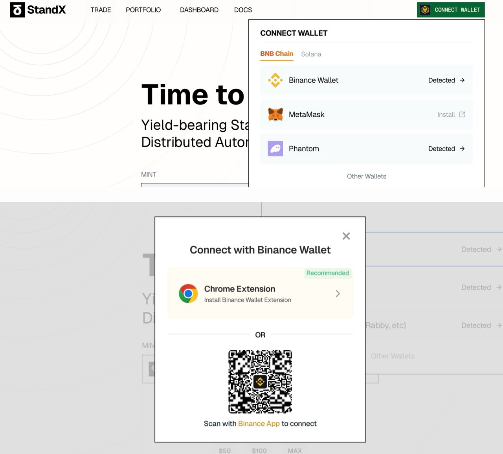
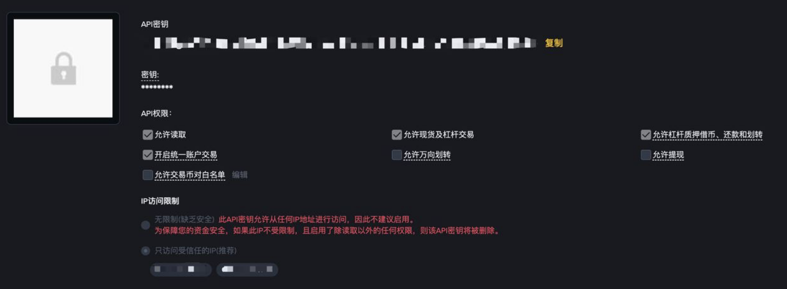
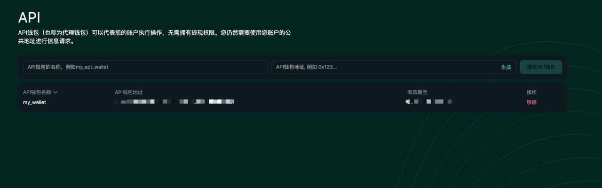
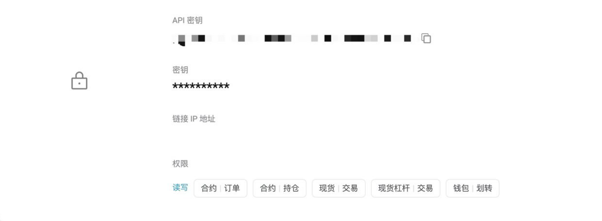
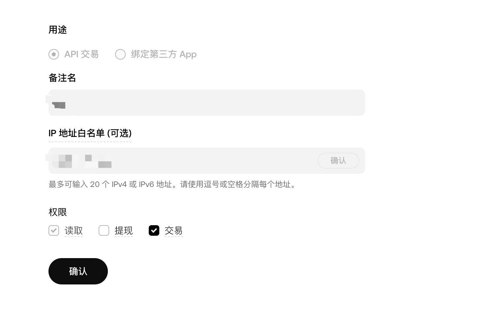
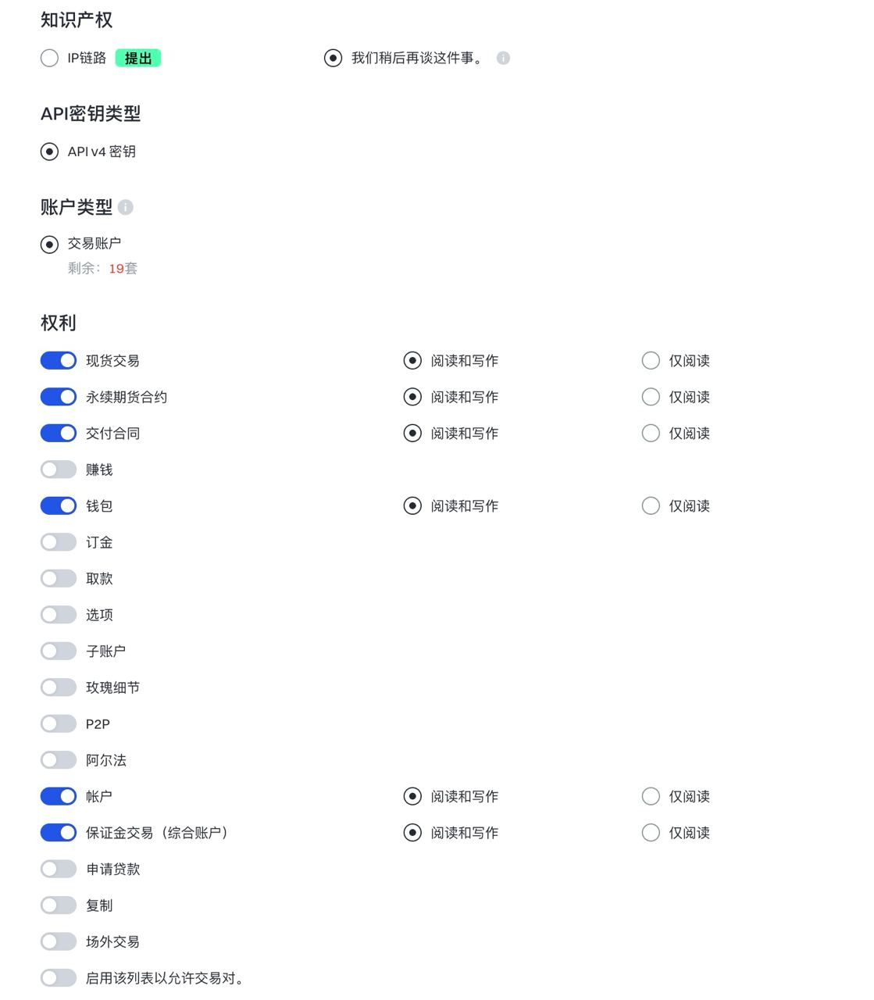
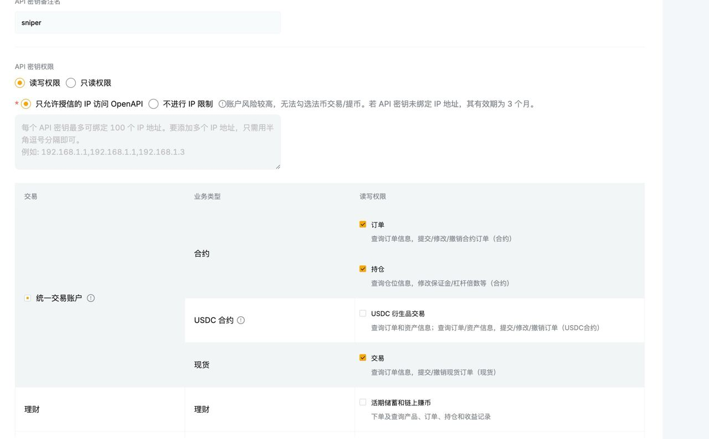

# Sniper 产品说明文档

跨交易所套利 & 多平台资金监控系统

## 产品介绍

### Sniper 产品介绍

**Sniper** 是一款面向交易用户的 **跨交易所套利 & 多平台资金监控系统**，通过实时价格监控与半自动下单机制，在两个交易所间捕捉价差机会，实现 **低风险 Spread 套利** 与 **资金费率搬砖收益**，无需人工盯盘。

适合套利玩家搭建专属策略系统。

### 当前支持交易所

- Binance
- Gate
- Bitget
- OKX
- Bybit
- StandX
- hyperliquid

其他交易所将根据，流动性与可控性，后续逐步接入。

### 多交易所 · 实时策略执行

- 实时行情、资金费率、仓位状态同步
- 策略级别独立运行，互不干扰
- 支持 FF / SF 等多种套利与对冲模式

每一个策略，都是一个独立、可控、可审计的执行单元。

### 实时数据驱动（非轮询）

- WebSocket 实时行情 / 深度
- 动态评估当前市场可执行性

### 订单簿级执行优化（核心优势）

- 基于真实订单簿深度计算可成交数量
- 动态评估滑点区间，避免一次性吃穿盘口
- 支持拆单执行，降低冲击成本
- 以最小滑点为目标，而非盲目追价

### 成本与手续费优化

- 双边手续费独立计算
- 下单数量与精度自动对齐交易所规则
- 避免因精度 / 数量错误造成额外损耗
- 在可行情况下优先选择更低手续费路径

### 内建风控体系（前置风控，而非事后补救）

- 最大仓位限制
- 单腿异常自动识别与标记
- MMR 实时监控
- 支持：
  - 禁止开仓
  - 禁止清仓
  - 已结算策略强制锁定，防止重复执行

### 精细化盈亏与成本统计

- 已实现 / 未实现利润严格分离
- 多次开平仓成本自动滚动
- 手续费和资金费按交易对、按方向独立累计
- 防止重复结算、重复统计

### 策略级生命周期管理

- 清晰的策略状态流转
- 运行中 / 已暂停
- 已结算策略不可再次开仓（强约束）
- 支持删除 / 归档，避免“僵尸策略”

### 本地部署 · 数据自持

- 私有部署，数据不外流
- 不托管资金、不共享策略
- Docker 一键安装，环境可复现
- 配置与数据完全由用户掌控

### 本系统仅适合具备以下条件的用户

- 有套利 / 量化经验
- 理解合约与资金费率机制
- 能独立承担交易风险

## 一键安装 Sniper（Docker）

### 云服务器环境要求

⚠️ 禁止使用中国大陆服务器，请部署在境外机器

推荐节点：

- 香港
- 日本 / 新加坡

推荐服务商：

- AWS / Vultr / 阿里云国际 / 腾讯云国际

⚠️ Sniper 不支持本地部署，API Key 若绑定 IP 白名单，换服务器需重新配置

## 系统与资源要求

⚠️ 当前版本仅支持 Ubuntu 系统部署

| 项目 | 最低要求 | 推荐配置 |
| --- | --- | --- |
| 操作系统 | Ubuntu 20.04+ | Ubuntu 22.04 LTS |
| 架构 | x86_64 | - |
| 内存 | >= 2GB | - |

## 一键部署

```bash
curl -L https://raw.githubusercontent.com/sniper327/sniper/refs/heads/main/install-in-docker.sh | sudo bash -
```

🔥 安装完成后务必开放服务器端口 `8870`。若未放行该端口，将无法访问 Web 面板。

## .env 配置说明

配置文件路径：

```bash
/data/sniper/config/.env
```

| 字段 | 说明 | 示例 |
| --- | --- | --- |
| PORT | Web 端口 | 8870 |
| SERVER_IP | 服务器公网 IP | 25.xxx.xxx.xxx |
| ADMIN_PASSWORD | 管理密码 | 12345678 |
| JWT_SECRET | Token 密钥 | 随机生成 |
| TWO_FA_SECRET | Google 2FA | 自动生成 |
| PREFIX | 访问前缀 | 随机生成 |

## 如何配置交易所 API？

⚠️ 安全至上，请严格遵守以下两条规则：

- 所有 API Key 必须绑定固定 IP 白名单（强制）
- 请务必关闭提现 / Withdraw 权限（只需交易与读取权限）

### StandX 交易所

1. 钱包注册，点击“连接钱包” - BNB 链 - 币安钱包
2. 登录 StandX 交易所，完成基础账户设置

推荐注册链接：

[https://standx.com/referral?code=sniperFi](https://standx.com/referral?code=sniperFi)

配图：



### Binance 交易所

1. 账户模式必须为“统一账户”，若当前为标准账户，请先切换后再创建 API
2. 新建 API Key 后，开启以下权限：

- Read 权限
- Futures 交易权限
- 禁止开启提现 Withdraw

3. 添加服务器 IP 到白名单

配图：



补充说明：

- 未绑定会导致交易失败或被风控限制

### Hyper 交易所

1. 登录 Hyper 后台，进入相关配置页面
2. 准备以下信息：

- 主钱包密钥
- 代理钱包

3. 将主钱包密钥和代理钱包填写到 Sniper 的交易所配置中
4. 保存后执行测试连接，确认配置可用

配图：



补充说明：

- Hyper 不需要配置 IP 白名单
- Hyper 这里不涉及常规交易权限勾选，按页面要求填写主钱包密钥和代理钱包即可

### Bitget / OKX / Gate / Bybit 交易所

每个交易所都需要：

- 读取权限
- 交易权限（双向持仓）
- 禁止提现
- 绑定服务器 IP

配图：





